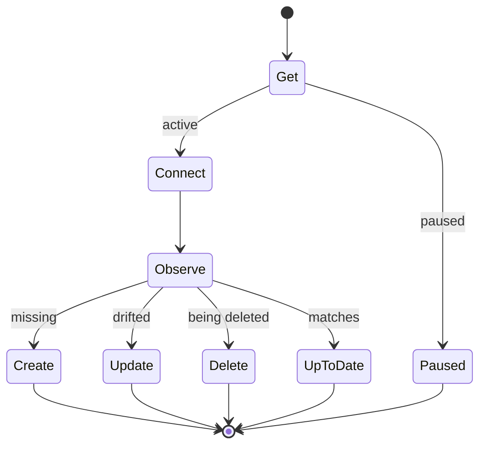

# Mental model

The lifecycle the library runs for you, and the operations you implement to plug into it.

## The managed-resource lifecycle

You hand the reconciler a typed custom resource and an implementation of a few operations. On every reconcile the framework asks your code to **observe** the external world, then — based on what you report — **creates**, **updates**, **deletes**, or does nothing, persisting conditions and managing the finalizer along the way.

You implement the boxes; the library implements everything else — getting the object, the pause check, finalizer add/remove, the safety steps around creation, persisting conditions and status, and requeue timing. The full sequence is in [`02-architecture.md`](./02-architecture.md).

## The operations you implement

- **Connect** — build whatever talks to the external system for *this* resource (an API client, a Kubernetes client, …), typically reading credentials from a referenced secret. It returns the client the four operations below will use.
- **Observe** — look at the external world and report two things: whether the resource **exists**, and whether it is **up to date**. It must not change the external resource. It may also report that it filled in some defaults (so the framework persists them) and, for debugging, a description of the drift it found.
- **Create / Update / Delete** — make the external world match the desired state.

The contract that keeps this safe:

- **Idempotent and non-blocking.** The framework can re-run any operation, so create must tolerate an already-existing resource and delete a missing one.
- **Observe is read-only on the outside world.** It can adjust the managed object's status in memory (the loop persists it), but it must not mutate the external resource.
- **The framework persists conditions and status, not your code.** You report observations and errors; the loop writes the `Ready`/`Synced` conditions and updates status.

> What "exists" and "up to date" mean is entirely yours to define — that's where a provider encodes how it compares desired state against the external system.
